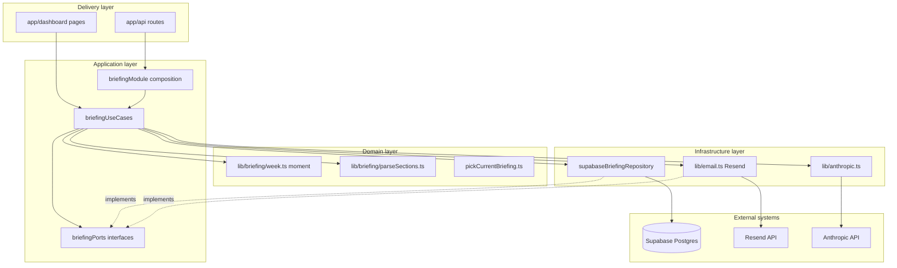
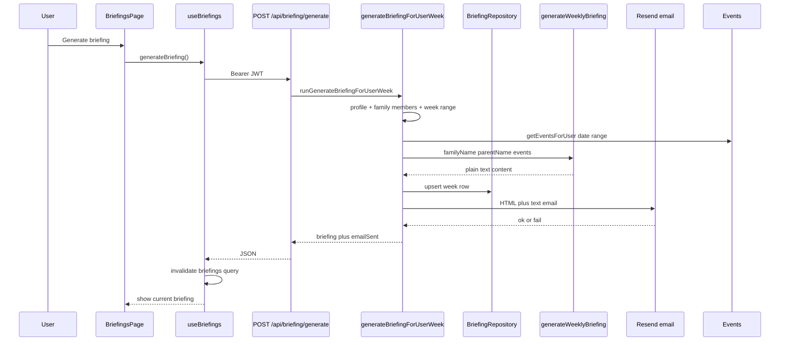

# FamilyBrief 🗓️

> Your family's AI chief of staff

## Why this project exists

This project is intentionally both a **real product** and a **sandbox for learning**. My goals are to:

- Explore how far I can get with **pair‑/live‑coding alongside AI**, and how much direction an experienced developer still needs to provide.
- Try out **modern tooling** (Next.js App Router, TanStack Query, Zustand, Supabase, Stripe, Resend) in a realistic, end‑to‑end app.
- Experiment with **AI technologies and APIs** (Anthropic / Claude) and see what good patterns for prompts, error‑handling, and observability look like.
- Learn **how to design and integrate AI features** into a web app in a maintainable, testable way (not just “call the model from a button click”).
- Solve a **real-world problem** my family (and many others) have: chaotic school/activity communications and calendar overload.
- Practice thinking like a **product manager**: breaking down the product into increments, roadmapping, and iterating based on feedback.
- Refine my own **development workflow in the AI era** — what to delegate to AI, what to keep as human judgment, and how to combine both effectively.

## What it does (current & planned)

- ✅ Displays a clean family calendar with colour-coded members
- ✅ Lets you add family members and events manually
- ✅ **Weekly briefing**: generate with Claude, save to Postgres, show in-app, email via Resend (`/dashboard/briefings`, `/api/briefing/generate`, `/api/briefing/list`)
- 🔜 Parses forwarded school/activity emails into calendar events using Claude AI
- 🔜 Scheduled Sunday morning briefing (cron calling the existing weekly-briefing job)

---

## Software design & architecture

### Design goals

| Goal | How we approach it |
|------|-------------------|
| **Testability** | Business rules live in pure functions and use cases; I/O behind interfaces (“ports”) so tests use fakes/mocks. |
| **Replaceable infrastructure** | Swap Supabase, Resend, or Anthropic without rewriting orchestration—only adapters change. |
| **Clear boundaries** | UI and HTTP handlers stay thin; they map DTOs and call application code, not SQL or SDKs directly. |
| **Honest pragmatism** | Full enterprise DDD everywhere would be heavy for a small app—**briefing** uses stricter layering; older areas still use `src/services/*` as a practical application layer. |

### Architectural style (clean architecture + DDD + SOLID)

We follow **Clean Architecture** ideas: **dependencies point inward**. Outer layers (Next.js routes, React, Supabase SDK, Resend) depend on inner abstractions; domain rules never import frameworks.

**DDD (lightweight):** The **briefing** feature is treated as a small **bounded context**: one logical aggregate per `(user_id, week_start)`—at most one persisted row per user per calendar week for manual/cron flows (enforced in application code via upsert, not only by DB constraints).

**SOLID (where it matters):**

- **S** — Single responsibility: `generateBriefingForUserWeek` orchestrates; `supabaseBriefingRepository` persists; `sendWeeklyBriefingEmail` sends mail.
- **O** — New channels (e.g. push) can implement the same ports without editing domain parsers.
- **L** — Repository and email implementations are swappable with test doubles.
- **I** — Small interfaces (`BriefingRepository`, `WeeklyBriefingEmailPort`, `EventQueryPort`) instead of one giant module.
- **D** — Use cases depend on ports; routes depend on use cases and a small **composition root** (`briefingModule`).

### Layered structure



**Domain (`src/lib/briefing/`):** Pure logic—no Supabase, no Resend. Calendar week boundaries and labels use **Moment.js** with **ISO week** semantics; **`Date`** is the in-memory type at boundaries; **`toIsoDateString` / `parseIsoDate`** convert for APIs and SQL. Plain-text briefing sections are parsed once for both **HTML email** and **in-app UI** so formatting never drifts.

**Application (`src/application/briefing/`):** **Ports** (`briefingPorts.ts`) define **BriefingRepository**, **WeeklyBriefingEmailPort**, **EventQueryPort**. **Use cases** (`briefingUseCases.ts`) implement `generateBriefingForUserWeek`, `listBriefingItemsForUser`, `recordBriefingFeedback`. **`briefingModule.ts`** wires concrete adapters for the generate API route.

**Infrastructure:** **`supabaseBriefingRepository`** maps rows ↔ domain types; **`email.ts`** implements the email port with the Resend SDK and shared HTML/text. **Anthropic** is called from use cases via the existing generator; we did not rewrite `generateWeeklyBriefing`—it stays a thin adapter over the SDK.

**Delivery:** API routes (`src/app/api/briefing/*`, `src/app/api/observability/feedback`) validate auth (`Authorization: Bearer` + `getAuthedUserIdFromRequest`), map to JSON, and delegate. Client hooks (`useBriefings`) and pages consume the API.

### Briefing: end-to-end flow (manual generate)



If email fails, the briefing is still **saved**; the API returns **`emailSent: false`** so the client can show accurate state.

### Authentication & data access

- **Browser:** `src/lib/supabase.ts` (anon key) for session and client-side auth.
- **Server:** `src/lib/supabaseAdmin.ts` (service role) **only** in server code (API routes, services). RLS on `weekly_briefings` allows users to **select** their rows; **inserts/updates** for generation use the service role so the same code paths work for cron and manual triggers without widening RLS for arbitrary client writes.

### Key technology choices (why)

| Choice | Reason |
|--------|--------|
| **Next.js 14 App Router** | File-based routes, API routes, React Server Components where useful, single deployable unit for Vercel. |
| **TanStack Query** | Server state for events, family, briefings—caching, invalidation after mutations, consistent loading/error UX. |
| **Zustand** | Minimal UI state (e.g. selected calendar day) without boilerplate. |
| **Supabase** | Postgres + Auth + fast iteration; RLS for defense in depth on client-readable tables. |
| **Service role in API only** | Central place to enforce “only this user’s data” after JWT verification. |
| **Moment.js** | Explicit calendar-week semantics (`isoWeek`) and stable formatting across environments; briefing code uses **`Date`** in TypeScript and converts at I/O boundaries. |
| **Resend** | Simple transactional email API; HTML + plain text from one send path. |
| **Claude (Anthropic)** | Family-facing copy and structured extraction; prompts live in `src/lib/anthropic.ts`. |
| **Jest + RTL** | Unit tests for domain, use cases, services, and API route handlers; `setupTests` sets env for Supabase client in tests. |

### Testing strategy

- **Domain:** `parseBriefingSections`, `getWeekStart` / `getWeekEnd`, `pickCurrentBriefing`.
- **Application:** `generateBriefingForUserWeek`, `listBriefingItemsForUser`, `recordBriefingFeedback` with mocked ports.
- **Infrastructure:** `briefingService` cron path with mocked repository and email.
- **HTTP:** Route tests with `@jest-environment node` and mocked auth or use cases.
- **UI:** Component tests for calendar pieces; briefings page relies on domain + hooks tests for faster feedback.

---

## Tech Stack (summary)

- **Framework:** Next.js 14 (App Router)
- **UI / state:** React 18, TanStack Query, Zustand, Tailwind + globals.css design tokens
- **Backend / data:** Supabase (Postgres + Auth) with `supabaseAdmin` on the server only
- **AI / email:** Anthropic Claude, Resend
- **Billing:** Stripe (trial / subscription)

## Project structure (updated)

```
src/
├── app/
│   ├── api/
│   │   ├── auth/logout/
│   │   ├── briefing/
│   │   │   ├── generate/       # POST – manual weekly briefing generation
│   │   │   └── list/           # GET – slim briefing list for sidebar
│   │   ├── events/             # Calendar CRUD via eventService
│   │   ├── family-members/
│   │   ├── observability/
│   │   │   └── feedback/       # POST – thumbs up/down (briefing id)
│   │   ├── parse-email/        # Inbound email → Claude → events
│   │   ├── parse-image/        # Image/PDF → Claude → events
│   │   ├── profile/
│   │   └── weekly-briefing/    # Cron – batch send for subscribed users
│   ├── dashboard/              # Calendar, briefings, family, settings
│   ├── onboarding/
│   └── auth/
├── application/
│   └── briefing/               # Ports, use cases, composition (briefingModule)
├── infrastructure/
│   └── briefing/
│       └── supabaseBriefingRepository.ts
├── components/
│   ├── calendar/
│   └── layout/                   # DashboardLayout (sidebar nav)
├── domain/                     # Domain helpers (e.g. calendar import, event/familyMember)
├── lib/
│   ├── anthropic.ts
│   ├── briefing/               # Pure domain: week + parseSections + pickCurrentBriefing
│   ├── email.ts                # Resend adapter (implements email port)
│   ├── apiAuth.ts
│   ├── supabase.ts / supabaseAdmin.ts
│   └── stripe.ts
├── services/                   # Application services (events, family, user, briefing orchestration)
├── hooks/                      # useEvents, useFamilyMembers, useBriefings
├── stores/
└── types/
```

---

## Setup

1. Clone and install

```bash
npm install
```

2. Copy env file and fill in keys

```bash
cp .env.example .env.local
```

3. Set up Supabase — run `supabase-schema.sql` in your project's SQL editor

4. Set up Stripe — create a $5/month recurring product and copy the price ID

5. Set up Resend — API key, verify domain, optionally inbound routing to `/api/parse-email`

6. Run locally

```bash
npm run dev
```

## E2E tests (Playwright)

Run `npm run test:e2e` (requires the dev server or will start it automatically when not in CI). The spec covers auth and check-email pages, and an optional **signed-in flow** (login → dashboard → add event) when `E2E_LOGIN_EMAIL` and `E2E_LOGIN_PASSWORD` are set.

## Deployment

Deploy to Vercel. Set up a cron job (Vercel Cron or GitHub Actions) to call `/api/weekly-briefing` on your desired schedule (e.g. Sunday morning).

## Tech Debt & Clean‑up Checklist

- [x] Extract remaining Supabase calls from client components/hooks into services + API routes
- [x] Consolidate auth flows (`/auth`, `/auth/check-email`, onboarding) and document the happy path
- [x] Add error boundary / empty state components for dashboard and family screens
- [x] Improve domain types (`src/domain/*`) with richer value objects and invariants
- [x] Set up Jest + React Testing Library and get a green test suite
- [x] Add unit tests for core services (`eventService`, `familyService`)
- [x] Add unit tests for remaining services (`briefingService`, `userService`)
- [x] Add component tests for key calendar UI (`CalendarGrid`, `EventSidebar`, `AddEventModal`)
- [x] Add E2E test for signup → onboarding → first event flow
- [x] Improve accessibility (focus states, ARIA roles, keyboard navigation across calendar)
- [ ] Add CI (GitHub Actions) to run tests and lint on every push/PR
- [ ] Track and enforce minimum test coverage thresholds over time

## Auth & Onboarding – Happy Path

1. **Signup or login (`/auth`)**
   - New users land on `/auth` in **signup** mode, enter email + password, and submit.
   - Existing users switch to **login** mode on the same screen, enter credentials, and submit.
2. **Email confirmation (`/auth/check-email`)**
   - On successful signup, the app redirects to `/auth/check-email?email=<user email>` and Supabase sends a confirmation email.
   - The user opens the email, clicks the confirmation link, then returns to `/auth` and signs in with the same credentials.
3. **Onboarding (`/onboarding`)**
   - On successful login, the app redirects to `/onboarding` for family setup.
   - `/onboarding` requires an active Supabase session; unauthenticated visitors are redirected back to `/auth`.
   - The user adds their own name + family name, then adds one or more family members and saves.
4. **Forwarding + trial**
   - After saving profile + members, onboarding walks through email forwarding and then offers to start the Stripe trial.
   - From here the user can either **start the free trial** or **skip** straight to the dashboard (`/dashboard`).

## Product Roadmap (High Level)

### v0.1 – Private Alpha

- [x] Basic family calendar with manual event entry
- [ ] Email parsing into events for a single family
- [x] Weekly briefing email per family (manual generate + in-app history)
- [ ] Simple settings page (manage subscription, email preferences)

### v0.2 – Multi‑family polish

- [ ] Shared calendar view across multiple guardians
- [ ] Per‑child preferences (who gets which briefings / notifications)
- [ ] Better mobile layout for week strip and sidebar

### v0.3 – Insights & automation

- [ ] “Clash detection” for overlapping events across family members
- [ ] Smart reminders (travel time, packing lists) based on event type
- [ ] Briefing history view inside the app with search/filter
