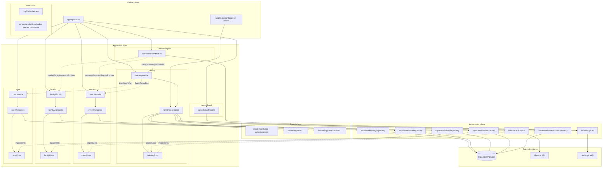
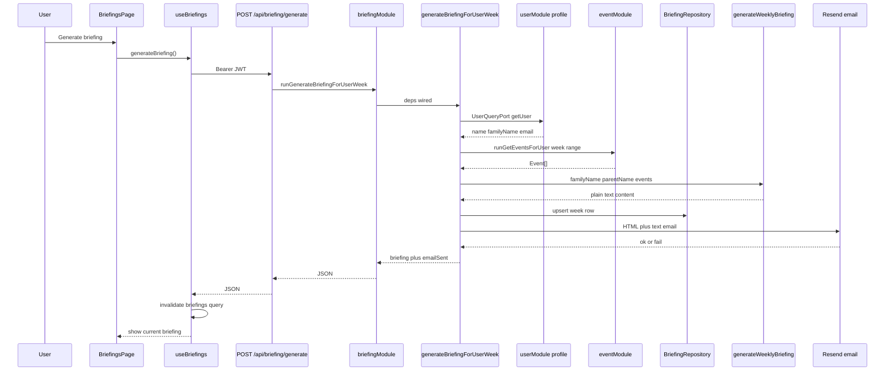

# FamilyBrief 🗓️

[](https://github.com/LukeAveil/familyBrief/actions/workflows/ci.yml)

> Your family's AI chief of staff

## Why this project exists

This project is intentionally both a **real product** and a **sandbox for learning**. My goals are to:

- Explore how far I can get with **pair‑/live‑coding alongside AI**, and how much direction an experienced developer still needs to provide.
- Try out **modern tooling** (Next.js App Router, TanStack Query, Zustand, Supabase, Stripe, Resend) in a realistic, end‑to‑end app.
- Experiment with **AI technologies and APIs** (Anthropic / Claude) and see what good patterns for prompts, error‑handling, and observability look like.
- Learn **how to design and integrate AI features** into a web app in a maintainable, testable way (not just “call the model from a button click”).
- Solve a **real-world problem** my family (and many others) have: chaotic school/activity communications and calendar overload.
- Practice thinking like a **product manager**: breaking down the product into increments, roadmapping, and iterating based on feedback.
- Refine my own **development workflow in the AI era** — what to delegate to AI, what to keep as human judgment, and how to combine both effectively.

## What it does (current & planned)

- ✅ Displays a clean family calendar with colour-coded members
- ✅ Lets you add family members and events manually
- ✅ **Weekly briefing**: generate with Claude, save to Postgres, show in-app, email via Resend (`/dashboard/briefings`, `/api/briefing/generate`, `/api/briefing/list`)
- ✅ **Inbound parse-email**: `POST /api/parse-email` turns forwarded mail into events (Claude + Postgres) when inbound routing is configured
- ✅ **Cron batch send**: `POST /api/weekly-briefing` (Bearer `CRON_SECRET`) runs `runSendWeeklyBriefingsForActiveUsers` (via `briefingModule`) for all **active** subscribers and returns `{ sent, total }`

---

## Software design & architecture

### Design goals

| Goal | How we approach it |
|------|-------------------|
| **Testability** | Business rules live in pure functions and use cases; I/O behind interfaces (“ports”) so tests use fakes/mocks. |
| **Replaceable infrastructure** | Swap Supabase, Resend, or Anthropic without rewriting orchestration—only adapters change. |
| **Clear boundaries** | UI and HTTP handlers stay thin; they map DTOs and call application code, not SQL or SDKs directly. |
| **Honest pragmatism** | All bounded contexts (**briefing**, **events**, **family**, **user**, **parsedEmail**, **calendarImport**) use ports / use cases / modules; **`supabaseAdmin`** stays in **`src/infrastructure/*`** and **`src/lib/supabaseAdmin.ts`** (plus auth token verification). Routes call only `run*` module functions — no service layer or direct SDK calls. |

### Architectural style (clean architecture + DDD + SOLID)

We follow **Clean Architecture** ideas: **dependencies point inward**. Outer layers (Next.js routes, React, Supabase SDK, Resend) depend on inner abstractions; domain rules never import frameworks.

**DDD (lightweight):** The **briefing** feature is treated as a small **bounded context**: one logical aggregate per `(user_id, week_start)`—at most one persisted row per user per calendar week for manual/cron flows (enforced in application code via upsert, not only by DB constraints).

**SOLID (where it matters):**

- **S** — Single responsibility: `generateBriefingForUserWeek` orchestrates; `supabaseBriefingRepository` persists; `sendWeeklyBriefingEmail` sends mail.
- **O** — New channels (e.g. push) can implement the same ports without editing domain parsers.
- **L** — Repository and email implementations are swappable with test doubles.
- **I** — Small interfaces (`BriefingRepository`, `WeeklyBriefingEmailPort`, `EventQueryPort`, `UserQueryPort`, `EventRepository`, `FamilyRepository`, `UserRepository`, …) instead of one giant module.
- **D** — Use cases depend on ports; routes delegate to **composition roots** (`briefingModule`, `eventModule`, `familyModule`) that wire concrete adapters.

### Layered structure



**Domain (`src/domain/` + `src/lib/briefing/`):** Core model types (**`Event`**, **`FamilyMember`**, **`User`**, briefing types) and invariants live under **`src/domain/`**; **`src/types/index.ts`** re-exports them for existing **`@/types`** imports. Calendar-import helpers (**`calendarImport`**, extracted-event rows) and **`EVENT_CATEGORIES`** live next to that model. **`src/lib/api/schemas/primitives.ts`** builds **Zod** enums from the same **`EVENT_CATEGORIES`** / **`FAMILY_MEMBER_ROLES`** tuples so API validation cannot drift from the domain. **`src/lib/briefing/`** holds pure week math, section parsing, and “current briefing” selection—no Supabase, no Resend. Calendar week boundaries and labels use **Moment.js** with **ISO week** semantics; **`Date`** is the in-memory type at boundaries; **`toIsoDateString` / `parseIsoDate`** convert for APIs and SQL. Plain-text briefing sections are parsed once for both **HTML email** and **in-app UI** so formatting never drifts.

**Application — briefing (`src/application/briefing/`):** **Ports** define **BriefingRepository** (including **`recordFeedback`** → **`briefing_feedback`** table), **WeeklyBriefingEmailPort**, **EventQueryPort**, **UserQueryPort** (slim user fields for generation + email), and **`ActiveUsersQueryPort`** (cron subscriber list). **Use cases** implement: **`generateBriefingForUserWeek`** (loads events for the week, generates with Claude, upserts, emails), **`listBriefingItemsForUser`**, **`recordBriefingFeedback`**, **`ensureBriefingForWeek`** (event-driven refresh for a single week), **`syncBriefingsForDates`** (deduplicates weeks across a list of dates, non-fatal per-week errors), and **`sendWeeklyBriefingsForActiveUsers`** (cron batch — calls `generateBriefingForUserWeek` for each active subscriber via `Promise.allSettled`). **`briefingModule.ts`** wires concrete adapters and exposes `run*` functions — notably `runSyncBriefingsForDates` (called after event create/delete/import) and `runSendWeeklyBriefingsForActiveUsers` (called by the cron route).

**Application — events (`src/application/events/`):** **EventRepository** includes bulk **`insertExtractedEventsForUser`** for email/vision imports. **`eventModule.ts`** exposes **`runInsertExtractedEventsForUser`** alongside the existing run functions.

**Application — family (`src/application/family/`):** **FamilyRepository**, **`runGetFamilyMembersForUser`**, etc.—used by parse-email, parse-image, and other flows (not by the manual weekly generate path).

**Application — user (`src/application/user/`):** **UserRepository** + **`runGetUserProfile`**, **`runUpsertUserProfile`**, **`runGetActiveSubscribedUsers`** (cron subscriber list). **`GET/POST /api/profile`** and other callers use **`userModule`**, not a legacy service layer.

**Application — parsed email (`src/application/parsedEmail/`):** Small port + **`runRecordParsedEmail`** so **`/api/parse-email`** never talks to **`supabaseAdmin`** directly for **`parsed_emails`**.

**Application — calendarImport (`src/application/calendarImport/`):** **`calendarImportModule.ts`** owns the end-to-end image/PDF upload pipeline: validate file → resolve MIME type → load family members via `familyModule` → call Claude vision → build insert rows from domain helpers → insert events via `eventModule` → refresh briefings via `runSyncBriefingsForDates`. Exposed as **`runProcessParseImageUpload`** so the route stays thin and all sub-steps are testable via module mocks.

**Infrastructure:** **`supabaseBriefingRepository`** uses the **`upsert_weekly_briefing`** RPC for atomic week rows and implements **`recordFeedback`**. **`supabaseEventRepository`**, **`supabaseFamilyRepository`**, **`supabaseUserRepository`**, **`supabaseParsedEmailRepository`** map DB rows ↔ types. **`email.ts`** implements the email port (Resend). **Anthropic** is **`lib/anthropic.ts`**; briefing generation still calls **`generateWeeklyBriefing`** from there.

**Delivery:** API routes stay thin: auth → Zod I/O → `run*` module call → `jsonResponse`. All routes import from **`briefingModule`**, **`eventModule`**, **`familyModule`**, **`userModule`**, **`parsedEmailModule`**, or **`calendarImportModule`**. No route touches `supabaseAdmin` or any service layer directly. Date fields in responses (e.g. briefing list) are serialized explicitly to ISO strings before `jsonResponse`, not via JSON round-tripping. Client hooks parse responses with the **same Zod schemas** as the server.

### HTTP contracts with Zod (`src/lib/api/`)

All JSON **App Router** handlers under `src/app/api/**` use shared schemas so inputs and outputs match the types the UI expects:

| Piece | Role |
|--------|------|
| [`src/lib/api/schemas/`](src/lib/api/schemas/) | **Primitives** (event category and family role enums align with **`src/domain`** tuples), **request bodies**, **query objects**, and **response** shapes (events, members, briefings, cron `{ sent, total }`, errors). |
| [`src/lib/api/httpZod.ts`](src/lib/api/httpZod.ts) | **`parseJsonBody(req, schema)`** — `safeParse` + `400` with `{ error }` on failure; **`parseSearchParams(url, build, schema)`** for query strings; **`jsonResponse(data, schema, init?)`** — `schema.parse` before `NextResponse.json` so bad domain-to-JSON mapping fails in tests/CI. |

**Usage pattern (routes):** after auth, call `parseJsonBody` / `parseSearchParams`; on success pass typed `data` into use cases; return with `jsonResponse(...)`. **Multipart** [`parse-image`](src/app/api/parse-image/route.ts) only validates the **success JSON** (`events` + `count`), not the form body.

**Usage pattern (hooks):** `await res.json()` then **`schema.parse(raw)`** (or `errorResponseSchema.safeParse` on errors) so a breaking API change throws early instead of corrupting React state.

**Errors:** Invalid JSON → `400` + `{ error: "Invalid JSON" }`. Zod validation failures → `400` + `{ error: "<first issue message>" }`. Most auth failures still use `{ error: "…" }` with `401`/`403` as before.

### Briefing: end-to-end flow (manual generate)



If email fails, the briefing is still **saved**; the API returns **`emailSent: false`** so the client can show accurate state.

### Authentication & data access

- **Browser:** `src/lib/supabase.ts` (anon key) for session and client-side auth.
- **Server:** `src/lib/supabaseAdmin.ts` (service role) is used exclusively from **infrastructure adapters** (`src/infrastructure/**`) and **`src/lib/apiAuth.ts`** (Bearer token verification). No route, module, or use case imports it directly. RLS on `weekly_briefings` allows users to **select** their rows; **writes** for generation and cron use the service role. **`briefing_feedback`** rows are inserted server-side after verifying the briefing belongs to the user.

### Key technology choices (why)

| Choice | Reason |
|--------|--------|
| **Next.js 14 App Router** | File-based routes, API routes, React Server Components where useful, single deployable unit for Vercel. |
| **TanStack Query** | Server state for events, family, briefings—caching, invalidation after mutations, consistent loading/error UX. |
| **Zustand** | Minimal UI state (e.g. selected calendar day) without boilerplate. |
| **Supabase** | Postgres + Auth + fast iteration; RLS for defense in depth on client-readable tables. |
| **Service role in API only** | Central place to enforce “only this user’s data” after JWT verification. |
| **Moment.js** | Explicit calendar-week semantics (`isoWeek`) and stable formatting across environments; briefing code uses **`Date`** in TypeScript and converts at I/O boundaries. |
| **Resend** | Simple transactional email API; HTML + plain text from one send path. |
| **Claude (Anthropic)** | Family-facing copy and structured extraction; prompts live in `src/lib/anthropic.ts`. |
| **Zod** | Runtime validation for API JSON bodies, query params, and responses; shared with client hooks under `src/lib/api/schemas`. |
| **Jest + RTL** | Unit tests for domain, use cases, infrastructure adapters, remaining services, and API route handlers; `setupTests` sets env for Supabase client in tests. |

### Testing strategy

- **Domain:** `parseBriefingSections`, `getWeekStart` / `getWeekEnd`, `pickCurrentBriefing`, calendarImport helpers (`coerceIsoDate`, `validateUploadedFile`, `resolveMediaTypeForVision`, `buildInsertRowsFromExtracted`, etc.).
- **Application:** `generateBriefingForUserWeek`, `listBriefingItemsForUser`, `recordBriefingFeedback`, `sendWeeklyBriefingsForActiveUsers` with mocked ports (deps injected directly — no module mocks needed); event/family use cases tested via repository fakes.
- **Infrastructure:** Supabase adapters (briefing, events, family, user, parsed email) with mocked `supabaseAdmin`; feedback use case asserts `recordFeedback` on the repository.
- **HTTP:** Route tests with `@jest-environment node`, mocked auth, and mocked module functions (`run*` from `briefingModule`, `calendarImportModule`, etc.); Zod rejects bad bodies (e.g. feedback without `briefingId`) with `400`.
- **calendarImport pipeline:** `runProcessParseImageUpload` tested end-to-end with mocked `familyModule`, `eventModule`, `briefingModule`, and `@/lib/anthropic`.
- **UI:** Component tests for calendar pieces; briefings page relies on domain + hooks tests for faster feedback.

---

## Tech Stack (summary)

- **Framework:** Next.js 14 (App Router)
- **UI / state:** React 18, TanStack Query, Zustand, Tailwind + globals.css design tokens
- **Backend / data:** Supabase (Postgres + Auth) with `supabaseAdmin` on the server only; **Zod** for API I/O under `src/lib/api/`
- **AI / email:** Anthropic Claude, Resend
- **Billing:** Stripe (trial / subscription)

## Project structure (updated)

```
src/
├── app/
│   ├── api/
│   │   ├── auth/logout/
│   │   ├── briefing/
│   │   │   ├── generate/       # POST – manual weekly briefing generation
│   │   │   └── list/           # GET – slim briefing list for sidebar
│   │   ├── events/             # Calendar CRUD via eventModule + Zod
│   │   ├── family-members/
│   │   ├── observability/
│   │   │   └── feedback/       # POST – thumbs up/down (briefing id)
│   │   ├── parse-email/        # Inbound email → Claude → events
│   │   ├── parse-image/        # Image/PDF → Claude → events
│   │   ├── profile/
│   │   └── weekly-briefing/    # Cron – batch send for subscribed users
│   ├── dashboard/              # Calendar, briefings, family, settings
│   ├── onboarding/
│   └── auth/
├── application/
│   ├── briefing/               # Ports (incl. ActiveUsersQueryPort), use cases (sync + cron + generate), briefingModule
│   ├── calendarImport/         # runProcessParseImageUpload (image/PDF → events pipeline)
│   ├── events/                 # eventPorts, eventUseCases, eventModule
│   ├── family/                 # familyPorts, familyUseCases, familyModule
│   ├── user/                   # userPorts, userUseCases, userModule
│   └── parsedEmail/            # parsed email ingest port + module
├── infrastructure/
│   ├── briefing/
│   │   └── supabaseBriefingRepository.ts  # RPC upsert + feedback insert
│   ├── events/
│   │   └── supabaseEventRepository.ts
│   ├── family/
│   │   └── supabaseFamilyRepository.ts
│   ├── user/
│   │   └── supabaseUserRepository.ts
│   └── parsedEmail/
│       └── supabaseParsedEmailRepository.ts
├── components/
│   ├── calendar/
│   └── layout/                   # DashboardLayout (sidebar nav)
├── domain/                     # Core types + invariants; calendarImport; re-exported via types/
├── lib/
│   ├── api/
│   │   ├── httpZod.ts          # parseJsonBody, parseSearchParams, jsonResponse
│   │   └── schemas/            # Zod: bodies, queries, responses, primitives
│   ├── anthropic.ts
│   ├── briefing/               # Pure domain: week + parseSections + pickCurrentBriefing
│   ├── email.ts                # Resend adapter (implements email port)
│   ├── apiAuth.ts
│   ├── supabase.ts / supabaseAdmin.ts
│   └── stripe.ts
├── hooks/                      # useEvents, useFamilyMembers, useBriefings
├── stores/
└── types/                      # Barrel re-exporting @/domain types
```

---

## Setup

**Node version:** This repo targets **Node 20** (see [`.nvmrc`](.nvmrc)). Use `nvm use` (or install Node 20) before `npm install`. Running on **Node 18** works for many tasks but you will see `EBADENGINE` warnings from npm and from current **Supabase** packages, which declare `>=20`.

1. Clone and install

```bash
npm install
```

2. Copy env file and fill in keys

```bash
cp .env.example .env.local
```

3. Set up Supabase — apply **`supabase-schema.sql`** (or use the Supabase CLI) and run **SQL migrations** under **`supabase/migrations/`** (unique **`(user_id, week_start)`** on **`weekly_briefings`**, **`upsert_weekly_briefing`**, **`briefing_feedback`**, and any later patches). Fresh environments should rely on migrations as the source of truth.

4. Set up Stripe — create a $5/month recurring product and copy the price ID

5. Set up Resend — API key, verify domain, optionally inbound routing to `/api/parse-email`

6. Run locally

```bash
npm run dev
```

### npm audit and Next.js

`npm audit` may still report **high** findings for **`next`** even on the latest **14.2.x** (e.g. `14.2.35`). The suggested `npm audit fix --force` typically installs **Next 15+** or **16**—a **major upgrade**, not a safe patch.

**Recommendation:** Keep **`next@^14.2.35`** until you deliberately migrate to Next 15/16 and regression-test the app. Avoid `npm audit fix --force` unless that is your goal. Several advisories target specific setups (e.g. self-hosted image optimizer, rewrites); check each [GitHub advisory](https://github.com/advisories) against how you deploy.

## GitHub Actions CI

Workflow: [`.github/workflows/ci.yml`](.github/workflows/ci.yml) runs on **push** and **pull_request** to **`main`**: checkout, Node from [`.nvmrc`](.nvmrc) with npm caching, `npm ci`, `npx tsc --noEmit`, ESLint (`next lint --max-warnings 0`), `npm test -- --coverage --ci`, and `npm run build`. Playwright E2E is not part of this workflow.

The job sets **dummy string values** for the same variables as `.env.example` (hardcoded in the workflow) so typecheck, tests, and `next build` can run without GitHub secrets. Use real keys in `.env.local` for local development and in your host (e.g. Vercel) for production.

The ESLint step installs `eslint@8` and `eslint-config-next@14.2.0` only on the runner (not added to `package.json`) so `next lint` can run without interactive setup.

## E2E tests (Playwright)

Run `npm run test:e2e` (requires the dev server or will start it automatically when not in CI). The spec covers auth and check-email pages, and an optional **signed-in flow** (login → dashboard → add event) when `E2E_LOGIN_EMAIL` and `E2E_LOGIN_PASSWORD` are set.

## Deployment

Deploy to Vercel. Set up a cron job (Vercel Cron or GitHub Actions) to **`POST /api/weekly-briefing`** with header **`Authorization: Bearer <CRON_SECRET>`** on your desired schedule (e.g. Sunday morning). The handler calls **`runSendWeeklyBriefingsForActiveUsers`** and returns real **`{ sent, total }`** counts for active subscribers.

## Tech Debt & Clean‑up Checklist

- [x] Extract remaining Supabase calls from client components/hooks into services + API routes
- [x] Consolidate auth flows (`/auth`, `/auth/check-email`, onboarding) and document the happy path
- [x] Add error boundary / empty state components for dashboard and family screens
- [x] Improve domain types (`src/domain/*`) with richer value objects and invariants
- [x] Set up Jest + React Testing Library and get a green test suite
- [x] Add unit tests for event/family Supabase adapters (`supabaseEventRepository`, `supabaseFamilyRepository`)
- [x] Add unit tests for use cases (`sendWeeklyBriefingsForActiveUsers`, user path via **`supabaseUserRepository`**)
- [x] Remove `src/services/` — all orchestration promoted to application use cases + modules (no service layer)
- [x] Add component tests for key calendar UI (`CalendarGrid`, `EventSidebar`, `AddEventModal`)
- [x] Add E2E test for signup → onboarding → first event flow
- [x] Improve accessibility (focus states, ARIA roles, keyboard navigation across calendar)
- [x] Add CI (GitHub Actions) to run tests and lint on every push/PR
- [ ] Track and enforce minimum test coverage thresholds over time

## Auth & Onboarding – Happy Path

1. **Signup or login (`/auth`)**
   - New users land on `/auth` in **signup** mode, enter email + password, and submit.
   - Existing users switch to **login** mode on the same screen, enter credentials, and submit.
2. **Email confirmation (`/auth/check-email`)**
   - On successful signup, the app redirects to `/auth/check-email?email=<user email>` and Supabase sends a confirmation email.
   - The user opens the email, clicks the confirmation link, then returns to `/auth` and signs in with the same credentials.
3. **Onboarding (`/onboarding`)**
   - On successful login, the app redirects to `/onboarding` for family setup.
   - `/onboarding` requires an active Supabase session; unauthenticated visitors are redirected back to `/auth`.
   - The user adds their own name + family name, then adds one or more family members and saves.
4. **Forwarding + trial**
   - After saving profile + members, onboarding walks through email forwarding and then offers to start the Stripe trial.
   - From here the user can either **start the free trial** or **skip** straight to the dashboard (`/dashboard`).

## Product Roadmap (High Level)

### v0.1 – Private Alpha

- [x] Basic family calendar with manual event entry
- [x] Email parsing into events for a single family (inbound **`/api/parse-email`**; configure routing + secrets)
- [x] Weekly briefing email per family (manual generate + in-app history)
- [ ] Simple settings page (manage subscription, email preferences)

### v0.2 – Multi‑family polish

- [ ] Shared calendar view across multiple guardians
- [ ] Per‑child preferences (who gets which briefings / notifications)
- [ ] Better mobile layout for week strip and sidebar

### v0.3 – Insights & automation

- [ ] “Clash detection” for overlapping events across family members
- [ ] Smart reminders (travel time, packing lists) based on event type
- [ ] Briefing history view inside the app with search/filter
